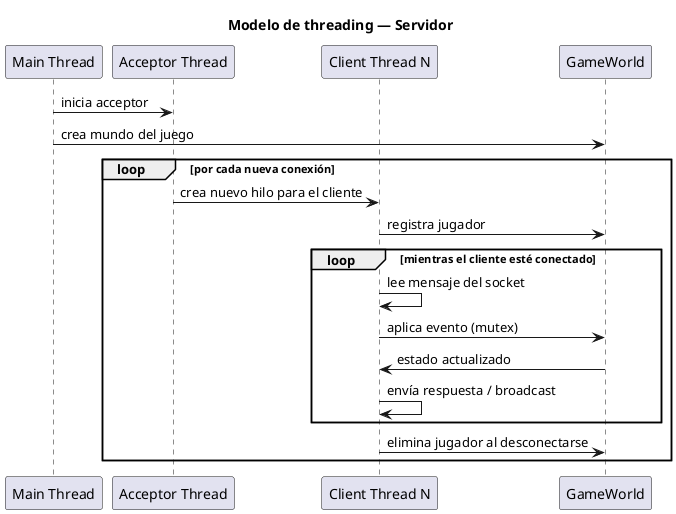
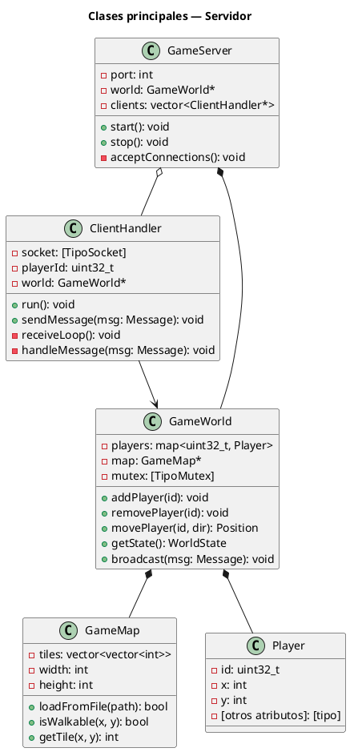
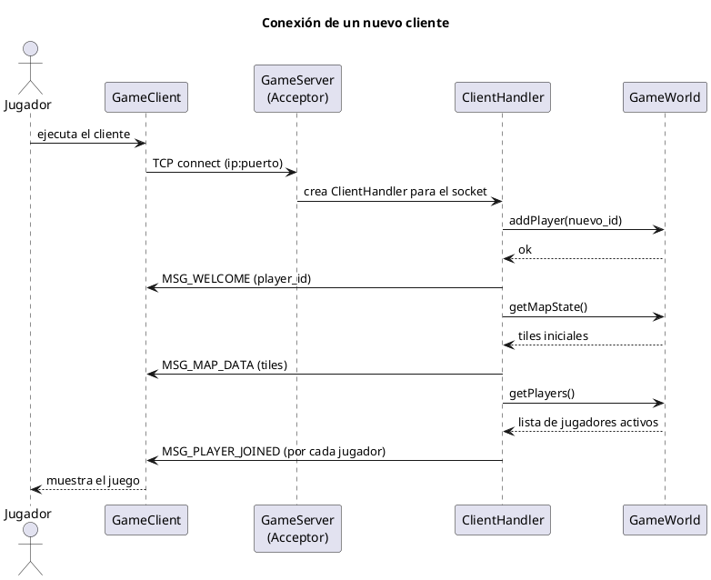
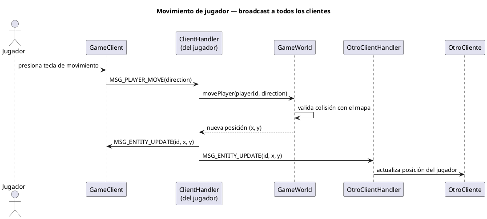
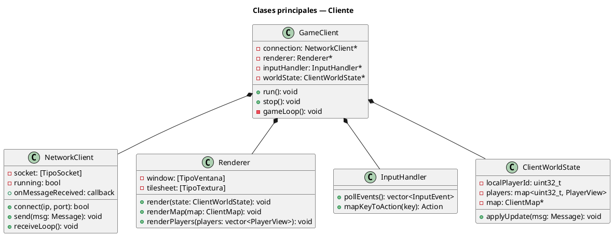
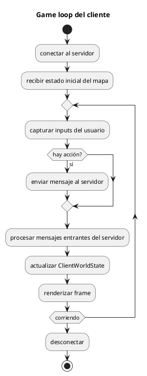
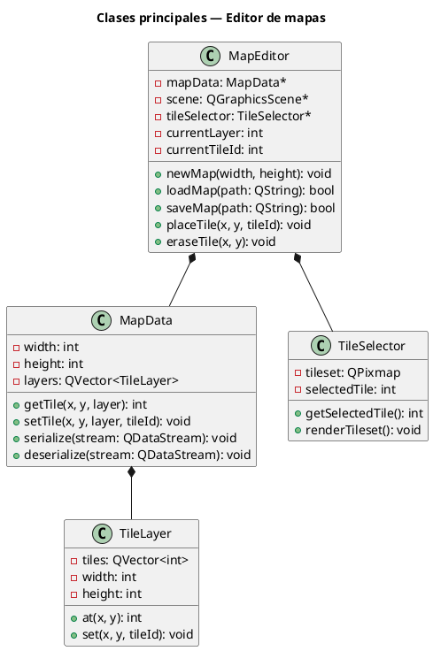
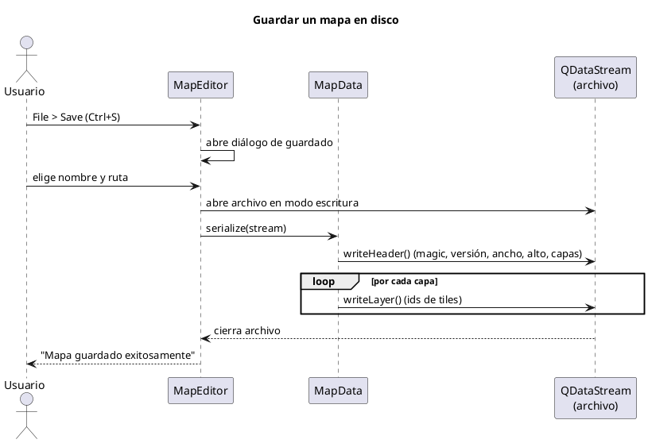
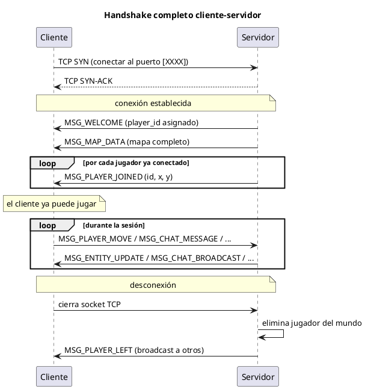

# Documentación Técnica — [Nombre del Proyecto]

> **Cómo usar este template:** Reemplazá todo lo que está entre corchetes `[así]`.
> Los bloques PlantUML son puntos de partida — ajustá los nombres de clases a los reales.
> Podés renderizar los diagramas en https://www.plantuml.com/plantuml/uml/

---

## Tabla de contenidos

1. [Arquitectura general](#arquitectura-general)
2. [Componente: Servidor](#componente-servidor)
3. [Componente: Cliente](#componente-cliente)
4. [Componente: Editor de mapas](#componente-editor-de-mapas)
5. [Protocolo de comunicación](#protocolo-de-comunicación)
6. [Formato del archivo de mapa](#formato-del-archivo-de-mapa)
7. [Decisiones de diseño](#decisiones-de-diseño)

---

## Resumen del proyecto

[Nombre del Proyecto] es un proyecto compuesto por [cliente / servidor / editor / otro componente] cuyo objetivo es [describir brevemente qué hace el sistema].

El sistema se divide en componentes separados para mantener responsabilidades claras:

- **Servidor:** mantiene el estado autoritativo del juego y procesa los mensajes de los clientes.
- **Cliente:** captura inputs, se comunica con el servidor y renderiza el estado recibido.
- **Editor de mapas:** permite crear mapas y exportarlos en el formato que luego consume el servidor.
- **Common / Shared:** contiene estructuras compartidas, constantes del protocolo y lógica común.

> Borrar o adaptar los componentes que no existan en el proyecto real.

---

## Arquitectura general

El proyecto está organizado con una arquitectura cliente-servidor. El servidor es la fuente de verdad del estado del juego: los clientes no modifican el estado directamente, sino que envían intenciones o acciones al servidor.

```text
[Editor de mapas]
       |
       | exporta archivo de mapa
       v
[Archivo de mapa] -------- carga al iniciar --------> [Servidor]
                                                        ^
                                                        |
                                                [Protocolo de red]
                                                        |
                                                        v
                                        [Cliente 1] [Cliente 2] [Cliente N]

| Componente | Tecnología principal | Binario generado |
|------------|---------------------|-----------------|
| Servidor   | C++, [lib de red]   | `build/server`  |
| Cliente    | C++, [Qt/SFML/SDL]  | `build/client`  |
| Editor     | C++, Qt 6 Widgets   | `build/editor`  |
```

<!-- TODO: ajustar tecnologías reales -->

### Estructura del repositorio

```
[nombre-repo]/
├── server/             ← código del servidor
│   ├── src/
│   └── include/
├── client/             ← código del cliente
│   ├── src/
│   └── include/
├── editor/             ← código del editor de mapas
│   ├── src/
│   └── include/
├── common/             ← librería compartida (protocolo, tipos)
│   ├── src/
│   └── include/
├── maps/               ← mapas de ejemplo
├── assets/             ← recursos gráficos y de audio
└── CMakeLists.txt      ← build raíz
```

<!-- TODO: ajustar la estructura real del repo con `tree -L 2` -->

---

## Componente: Servidor

### Responsabilidades

El servidor es el componente autoritativo del juego. Es responsable de:

- Aceptar y gestionar conexiones de múltiples clientes simultáneos.
- Mantener el estado del mundo del juego (posiciones, entidades, etc.).
- Procesar los eventos enviados por los clientes y validarlos.
- Propagar los cambios de estado a todos los clientes conectados.
- Cargar y servir el mapa al inicio.

### Modelo de threading

<!-- TODO: describir el modelo real. Ejemplos comunes:
- Un hilo por cliente (thread-per-connection)
- Event loop con un solo hilo
- Thread pool con cola de tareas
-->

[Descripción del modelo de threading utilizado.]



<!-- TODO: ajustar el diagrama al modelo real de threading del servidor -->

### Diagrama de clases — Servidor



<!-- TODO: reemplazar con los nombres de clases reales del servidor -->

### Diagrama de secuencia — Conexión de un cliente



<!-- TODO: ajustar con el flujo real de conexión -->

### Diagrama de secuencia — Movimiento de un jugador



<!-- TODO: ajustar con el flujo real de movimiento. Si hay más eventos (ataque, chat), agregar diagramas similares -->

---

## Componente: Cliente

### Responsabilidades

- Conectarse al servidor y mantener la sesión activa.
- Capturar los inputs del usuario y enviarlos al servidor.
- Recibir el estado del juego del servidor y renderizarlo.
- Mostrar el mapa, los personajes y la interfaz de usuario.

### Modelo de threading del cliente

<!-- TODO: describir si hay un hilo de red separado del hilo de rendering, o si usan un event loop -->

[Descripción del modelo de threading del cliente.]

### Diagrama de clases — Cliente



<!-- TODO: reemplazar con los nombres de clases reales del cliente -->

### Flujo del game loop del cliente



<!-- TODO: ajustar al game loop real del cliente -->

---

## Componente: Editor de mapas

### Responsabilidades

- Proveer una interfaz gráfica para crear y editar mapas.
- Serializar y deserializar mapas al formato binario del proyecto.
- Exportar mapas que el servidor pueda cargar directamente.

### Diagrama de clases — Editor



<!-- TODO: reemplazar con los nombres de clases reales del editor -->

### Diagrama de secuencia — Guardar un mapa



<!-- TODO: ajustar al mecanismo real de serialización -->

---

## Protocolo de comunicación

La comunicación entre servidor y clientes se realiza sobre **[TCP / UDP]** con un protocolo binario propio.

### Estructura de un paquete

Cada mensaje tiene el siguiente formato:

```
┌─────────────┬──────────────┬─────────────────────────┐
│  type (1B)  │  length (2B) │  payload (length bytes) │
└─────────────┴──────────────┴─────────────────────────┘
```

| Campo | Tipo | Tamaño | Descripción |
|-------|------|--------|-------------|
| `type` | `uint8` | 1 byte | Identificador del tipo de mensaje |
| `length` | `uint16` | 2 bytes | Longitud del payload en bytes |
| `payload` | `bytes` | variable | Datos del mensaje (ver tabla) |

<!-- TODO: ajustar al formato real del header de los paquetes -->

### Tabla de mensajes

| ID | Nombre | Dirección | Payload |
|----|--------|-----------|---------|
| `0x01` | `MSG_PLAYER_MOVE` | Cliente → Servidor | `uint8 direction` (0=arriba, 1=abajo, 2=izq, 3=der) |
| `0x02` | `MSG_ENTITY_UPDATE` | Servidor → Cliente | `uint32 entity_id, int16 x, int16 y` |
| `0x03` | `MSG_CHAT_MESSAGE` | Cliente → Servidor | `uint16 len, char[] text` |
| `0x04` | `MSG_CHAT_BROADCAST` | Servidor → Cliente | `uint32 player_id, uint16 len, char[] text` |
| `0x05` | `MSG_PLAYER_JOINED` | Servidor → Cliente | `uint32 player_id, int16 x, int16 y` |
| `0x06` | `MSG_PLAYER_LEFT` | Servidor → Cliente | `uint32 player_id` |
| `0x10` | `MSG_WELCOME` | Servidor → Cliente | `uint32 assigned_id` |
| `0x11` | `MSG_MAP_DATA` | Servidor → Cliente | `uint16 width, uint16 height, uint16[] tile_ids` |
| `[0xNN]` | `[NOMBRE]` | [dirección] | [campos] |

<!-- TODO: completar con TODOS los mensajes reales del protocolo -->

### Flujo de conexión completo



<!-- TODO: ajustar al flujo real de handshake -->

### Manejo de desconexión

<!-- TODO: describir qué pasa cuando un cliente se desconecta abruptamente (timeout, cierre de ventana, etc.) -->

- El servidor detecta la desconexión mediante [mecanismo: excepción en recv(), timeout, heartbeat].
- Se elimina al jugador del `GameWorld`.
- Se envía `MSG_PLAYER_LEFT` a todos los clientes conectados.
- [¿Se guarda el estado del jugador? ¿Hay persistencia?]

---

## Formato del archivo de mapa

Los mapas se almacenan en archivos binarios con extensión `.[ext]`.

### Estructura del archivo

#### Header (fijo, [N] bytes)

| Offset | Tamaño | Tipo | Descripción |
|--------|--------|------|-------------|
| `0x00` | 4 bytes | `uint32` | Magic number: `[0xXXXXXXXX]` |
| `0x04` | 2 bytes | `uint16` | Versión del formato |
| `0x06` | 2 bytes | `uint16` | Ancho del mapa (en tiles) |
| `0x08` | 2 bytes | `uint16` | Alto del mapa (en tiles) |
| `0x0A` | 2 bytes | `uint16` | Número de capas |
| `0x0C` | 4 bytes | `uint32` | [campo reservado / nombre del mapa / otro] |

<!-- TODO: completar con el header real. Revisar el código de serialize() en MapData -->

#### Datos de cada capa (repetido por cada capa)

| Offset | Tamaño | Tipo | Descripción |
|--------|--------|------|-------------|
| `+0` | 1 byte | `uint8` | ID de la capa |
| `+1` | `ancho × alto × 2` bytes | `uint16[]` | IDs de tiles en orden row-major (fila por fila) |

<!-- TODO: ajustar al formato real de las capas -->

### Ejemplo de archivo mínimo

Un mapa de 2×2 tiles con una sola capa de relleno con el tile `0` se vería así en hexadecimal:

```
Offset  Bytes          Descripción
0x00    XX XX XX XX   Magic number
0x04    01 00          Versión 1
0x06    02 00          Ancho: 2
0x08    02 00          Alto: 2
0x0A    01 00          1 capa
0x0C    00 00 00 00   Reservado

-- Capa 0 --
0x10    00             ID de capa: 0
0x11    00 00          tile (0,0) = 0
0x13    00 00          tile (1,0) = 0
0x15    00 00          tile (0,1) = 0
0x17    00 00          tile (1,1) = 0
```

<!-- TODO: completar con el ejemplo real del formato -->

### Código de referencia (serialización)

<!-- TODO: pegar aquí el fragmento de código de serialize() / deserialize() de MapData -->

```cpp
// Fragmento de MapData::serialize()
void MapData::serialize(QDataStream& stream) const {
    // TODO: pegar el código real aquí
}

// Fragmento de MapData::deserialize()
void MapData::deserialize(QDataStream& stream) {
    // TODO: pegar el código real aquí
}
```

---

## Decisiones de diseño

### ¿Cómo se sincroniza el estado entre múltiples clientes?

<!-- TODO: completar con el enfoque real -->

[Descripción. Ejemplo: "El servidor es la única fuente de verdad (server-authoritative). Los clientes envían intenciones (mover arriba) y el servidor valida y aplica el cambio, luego broadcastea el nuevo estado a todos."]

### [Otra decisión importante]

<!-- TODO: agregar otras decisiones de diseño relevantes del proyecto -->

[Descripción.]

## Checklist antes de entregar

- [ ] La documentación explica el objetivo del proyecto.
- [ ] La arquitectura general no es genérica: menciona componentes reales del proyecto.
- [ ] Los diagramas muestran clases importantes, no todas las clases.
- [ ] Los diagramas no incluyen getters, setters ni detalles triviales.
- [ ] Hay al menos un diagrama de clase útil.
- [ ] Hay al menos un diagrama de secuencia de una comunicación importante.
- [ ] El modelo de threading está explicado.
- [ ] El protocolo de comunicación tiene formato, tabla de mensajes y errores.
- [ ] El formato de archivos tiene estructura, ejemplo y validaciones.
- [ ] Las decisiones de diseño explican por qué se resolvió así.
- [ ] Hay una guía mínima para extender el proyecto.
- [ ] Se eliminaron secciones que no aplican al proyecto real.