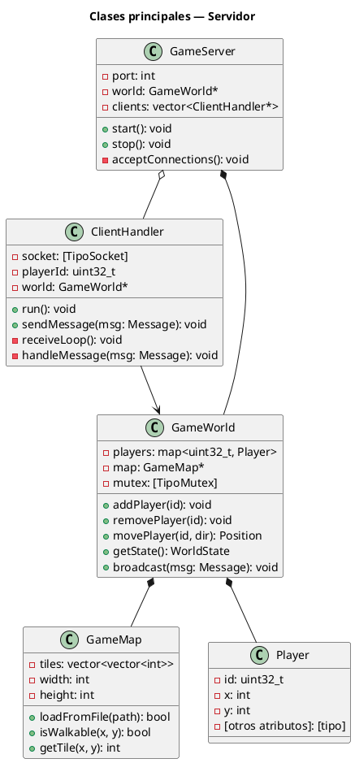
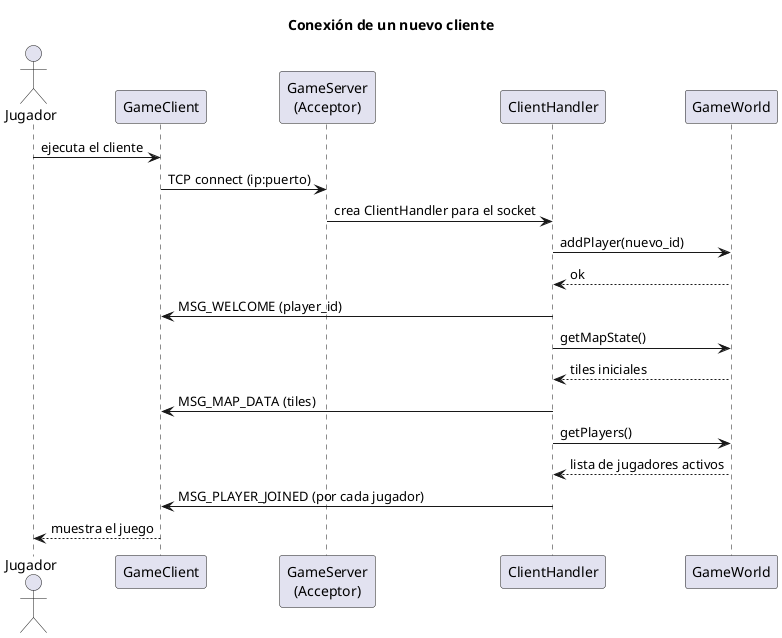
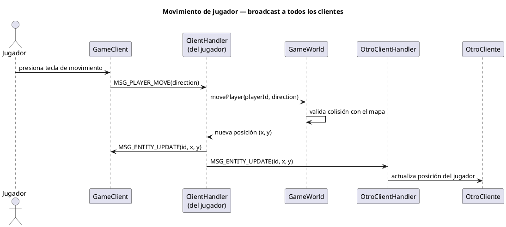
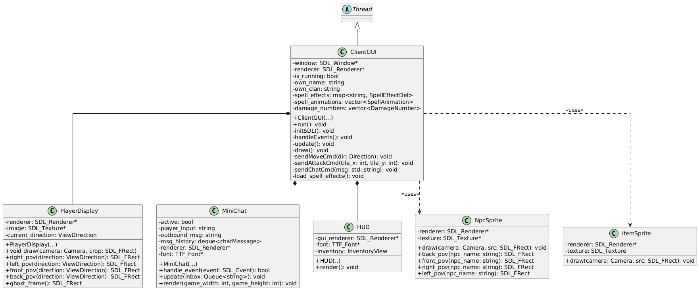
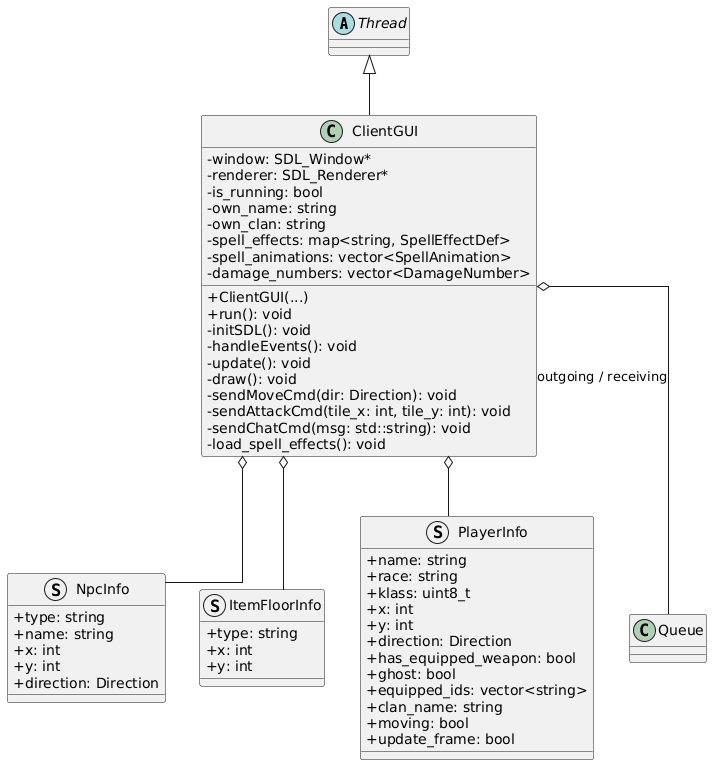
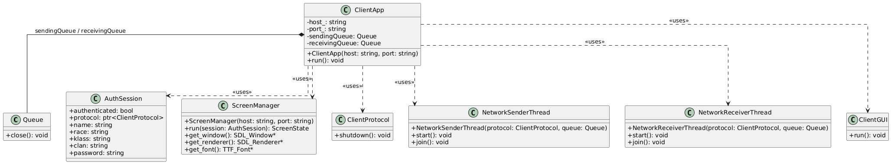
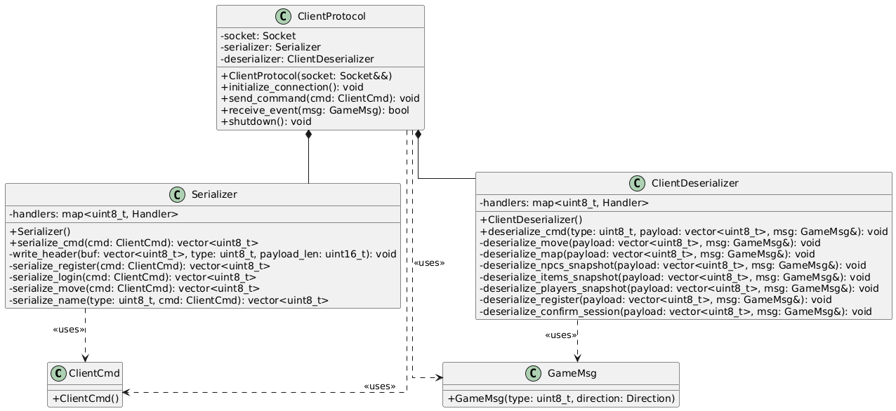

# Documentación Técnica — Argentum Online


## Tabla de contenidos

1. [Arquitectura general](#arquitectura-general)
2. [Componente: Servidor](#componente-servidor)
3. [Componente: Cliente](#componente-cliente)
4. [Componente: Editor de mapas](#componente-editor-de-mapas)
5. [Protocolo de comunicación](#protocolo-de-comunicación)
6. [Formato del archivo de mapa](#formato-del-archivo-de-mapa)
7. [Decisiones de diseño](#decisiones-de-diseño)

---

## Arquitectura general

El proyecto está organizado con una arquitectura cliente-servidor. El servidor es la fuente de verdad del estado del juego: los clientes no modifican el estado directamente, sino que envían intenciones o acciones al servidor.

```text
[Editor de mapas]
       |
       | exporta archivo de mapa
       v
[Archivo de mapa] -------- carga al iniciar --------> [Servidor]
                                                        ^
                                                        |
                                                [Protocolo de red]
                                                        |
                                                        v
                                        [Cliente 1] [Cliente 2] [Cliente N]

| Componente | Tecnología principal | Binario generado |
|------------|---------------------|-----------------|
| Servidor   | C++, [lib de red]   | `build/server`  |
| Cliente    | C++, [Qt/SFML/SDL]  | `build/client`  |
| Editor     | C++, Qt 6 Widgets   | `build/editor`  |
```

### Diagrama de paquetes

```
@startuml diagrama_paquetes_alto_nivel
title Diagrama de Paquetes - Argentum (vista de alto nivel)

skinparam packageStyle folder
skinparam shadowing false
skinparam package {
    BackgroundColor #F8F8F8
    BorderColor #555555
}

package "client" as client {
    [interface (GUI)]
    [comunication]
    [serializers]
    [audio]
    [clientApp]
}

package "server" as server {
    [Game]
    [communication]
    [serializer]
    [persistence]
    [gameloop]
}

package "common" as common {
    [socket]
    [commands]
    [constants]
    [info]
    [binaryMap]
    [utility]
}

client ..> common : <<import>>
server ..> common : <<import>>

note bottom of common
  common no depende de client ni de server.
  client y server NO se dependen entre si:
  se comunican por red usando los tipos
  compartidos definidos en common.
end note

@enduml
```

### Estructura del repositorio

```
[nombre-repo]/
├── server/             ← código del servidor
│   ├── src/
│   └── include/
├── client/             ← código del cliente
│   ├── src/
│   └── include/
├── editor/             ← código del editor de mapas
│   ├── src/
│   └── include/
├── common/             ← librería compartida (protocolo, tipos)
│   ├── src/
│   └── include/
├── maps/               ← mapas de ejemplo
├── assets/             ← recursos gráficos y de audio
└── CMakeLists.txt      ← build raíz
```

---

## Componente: Servidor

### Responsabilidades

El servidor es el componente autoritativo del juego. Es responsable de:

- Aceptar y gestionar conexiones de múltiples clientes simultáneos.
- Mantener el estado del mundo del juego (posiciones, entidades, etc.).
- Procesar los eventos enviados por los clientes y validarlos.
- Propagar los cambios de estado a todos los clientes conectados.
- Cargar y servir el mapa al inicio.

### Diagrama de clases — Servidor



### Diagrama de secuencia — Conexión de un cliente



### Diagrama de secuencia — Movimiento de un jugador



<!-- TODO: ajustar con el flujo real de movimiento. Si hay más eventos (ataque, chat), agregar diagramas similares -->

---

## Componente: Cliente

### Responsabilidades

- Conectarse al servidor y mantener la sesión activa.
- Capturar los inputs del usuario y enviarlos al servidor.
- Recibir el estado del juego del servidor y renderizarlo.
- Mostrar el mapa, los personajes y la interfaz de usuario.

### Diagrama de secuencia — Desde la ejecución del cliente hasta la partida

El siguiente diagrama muestra únicamente la colaboración entre el administrador
de pantallas, las pantallas iniciales y la sesión de autenticación.


### Diagrama de secuencia - Desconexión de un jugador

En este diagrama se muestra la desconexión de un jugador y la notificación al resto de players.


### Modelo de threading del cliente

[Descripción del modelo de threading del cliente.]

### Diagrama de clases — Cliente







---
## Protocolo de comunicación

La comunicación entre servidor y clientes se realiza sobre **[TCP / UDP]** con un protocolo binario propio.

### Estructura de un paquete

Cada mensaje tiene el siguiente formato:

```
┌─────────────┬──────────────┬─────────────────────────┐
│  type (1B)  │  length (2B) │  payload (length bytes) │
└─────────────┴──────────────┴─────────────────────────┘
```

| Campo | Tipo | Tamaño | Descripción |
|-------|------|--------|-------------|
| `type` | `uint8` | 1 byte | Identificador del tipo de mensaje |
| `length` | `uint16` | 2 bytes | Longitud del payload en bytes |
| `payload` | `bytes` | variable | Datos del mensaje (ver tabla) |

### Tabla de mensajes

| ID | Nombre | Dirección | Payload |
|----|--------|-----------|---------|
| `0x01` | `MSG_PLAYER_MOVE` | Cliente → Servidor | `uint8 direction` (0=arriba, 1=abajo, 2=izq, 3=der) |
| `0x02` | `MSG_ENTITY_UPDATE` | Servidor → Cliente | `uint32 entity_id, int16 x, int16 y` |
| `0x03` | `MSG_CHAT_MESSAGE` | Cliente → Servidor | `uint16 len, char[] text` |
| `0x04` | `MSG_CHAT_BROADCAST` | Servidor → Cliente | `uint32 player_id, uint16 len, char[] text` |
| `0x05` | `MSG_PLAYER_JOINED` | Servidor → Cliente | `uint32 player_id, int16 x, int16 y` |
| `0x06` | `MSG_PLAYER_LEFT` | Servidor → Cliente | `uint32 player_id` |
| `0x10` | `MSG_WELCOME` | Servidor → Cliente | `uint32 assigned_id` |
| `0x11` | `MSG_MAP_DATA` | Servidor → Cliente | `uint16 width, uint16 height, uint16[] tile_ids` |
| `[0xNN]` | `[NOMBRE]` | [dirección] | [campos] |

### Manejo de desconexión


## Editor de mapas

### Objetivo y alcance

El editor es una aplicación de escritorio desarrollada con C++20 y Qt6 Widgets.
Permite:

- cargar spritesheets PNG como tilesets;
- seleccionar tiles mediante su identificador global (`gid`);
- editar dos capas: `ground` y `buildings`;
- usar lápiz, goma y relleno;
- marcar colisiones y teleports;
- abrir y guardar mapas en formato binario `.bin`.

El mapa tiene dimensiones fijas definidas en `game_constants.h`:

| Propiedad | Valor |
|---|---:|
| Ancho | 30 celdas |
| Alto | 16 celdas |
| Tamaño de tile | 64 px |
| Capas de tiles | 2 |

### Diagrama de clases central

Este diagrama se centra en `EditorDocument`, porque conecta los eventos de la
interfaz, las estrategias de edición y el modelo.


### Secuencia de edición de tiles

La siguiente secuencia representa lápiz y goma. El relleno termina después del
`press` porque `paints_on_drag()` devuelve `false`.


#### Herramientas especiales

`Collision` y `Teleport` aparecen en la misma toolbar, pero no implementan
`Tool`:

- **Collision:** `EditorDocument` fija en el `press` el valor booleano que
  pintará durante todo el arrastre. Modifica `Map::collision_`.
- **Teleport:** funciona como toggle de una celda. Agrega o elimina un
  `TeleportDef{x, y, dest_zone}`.

En ambos casos se emite `cellChanged(-1,x,y)`. El valor `-1` indica que cambió
una superposición visual y no una capa de gids.

### Tilesets, selección y render


#### `TileLibrary`

`TileLibrary::loadTileset(path,tileSize)`:

1. carga el PNG en `m_masterPixmap`;
2. calcula cuántas filas y columnas completas contiene;
3. recorta cada tile y lo guarda en `m_tiles`;
4. conserva dimensiones y ruta de origen.

`m_masterPixmap` sirve para mostrar la plancha completa en
`TilesetSelectorView`. `m_tiles` permite obtener directamente un tile mediante
su índice local.

La llamada a `m_tiles.reserve(columns * rows)` reserva capacidad para evitar
realocaciones durante los `push_back`; no crea elementos.

Si el ancho o alto del PNG no es múltiplo de `tileSize`, los píxeles sobrantes
se ignoran.

#### Identificadores locales y globales

Cada tileset ocupa un rango global: gid = firstgid + localId

El gid `0` está reservado para una celda vacía. `Map::next_firstgid()` asigna el
primer gid libre al registrar un tileset.

`TilesetSelectorView` transforma el click sobre el PNG en un `localId`, suma
`firstgid` y emite `tileSelected(gid, pixmap)`.

#### Caché de render

`MapEditorScene::rebuildTileCache()` recorre los tilesets registrados, carga
cada PNG mediante una `TileLibrary` temporal y construye:

```cpp
QHash<int, QPixmap> m_tileCache; // gid -> imagen lista para dibujar
```

Así, al cambiar una celda, `updateVisualItem()` puede resolver el pixmap por gid
sin volver a recortar el spritesheet.

### Persistencia: guardar y abrir

- abrir: `EditorDocument::open()` usa `BinaryMapLoader`;
- guardar: `EditorWindow::save_to()` usa `BinaryMapSaver`.


Las rutas de PNG se guardan relativas a la carpeta de recursos compartida.
`paths::resource_relative()` prepara la ruta al guardar y
`paths::resolve_resource()` la convierte nuevamente en una ruta cargable

---
