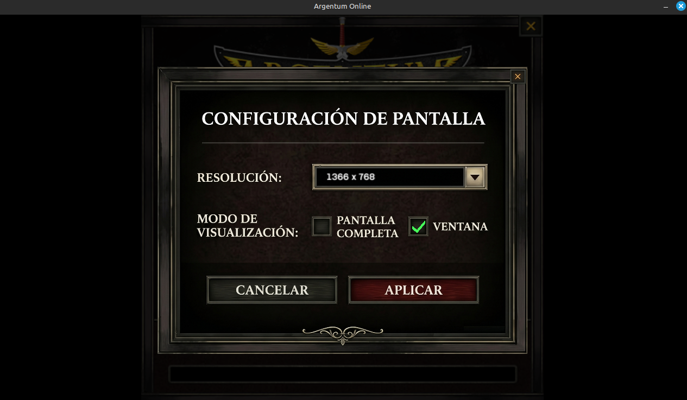

# Manual de Usuario — Argentum Online

## Tabla de contenidos

1. [Introducción](#introducción)
2. [Requisitos del sistema](#requisitos-del-sistema)
3. [Instalación de dependencias](#instalación-de-dependencias)
4. [Compilación del proyecto](#compilación-del-proyecto)
5. [Configuración inicial](#configuración-inicial)
6. [Modificar mapas y configuración sin recompilar](#modificar-mapas-y-configuración-sin-recompilar)
7. [Levantar el servidor](#levantar-el-servidor)
8. [Lanzar el cliente y jugar](#lanzar-el-cliente-y-jugar)
9. [Editor de mapas](#editor-de-mapas)
10. [Solución de problemas frecuentes](#solución-de-problemas-frecuentes)

---

## Introducción

Este proyecto es una recreación del juego Argentum Online que incluye tres componentes:

- **Servidor**: gestiona el estado del mundo del juego y las conexiones de los clientes.
- **Cliente**: permite a los jugadores conectarse, ver el mapa y jugar.
- **Editor de mapas**: herramienta para crear y editar los mapas que usa el servidor.

Este manual explica paso a paso cómo compilar, configurar y usar cada componente.

---

## Requisitos del sistema

### Sistema operativo

- **Ubuntu/Debian**

---

## Compilación del proyecto

### Instalador automático

El proyecto incluye `install.sh`, que instala las
dependencias de sistema (apt), inicializa los submódulos de SDL, compila,
corre los tests unitarios e instala el juego en tu home:

```bash
# Clonar el repositorio (con submódulos)
git clone --recurse-submodules https://github.com/juanbalella20/Tp---final-Taller-de-programacion-.git
cd [repositorio]

# Ejecutar el instalador
bash install.sh
```

Al terminar, todo queda instalado así:

| Qué | Dónde |
|-----|-------|
| Binarios (`client`, `server`, `map_editor`) | `~/.local/bin/` |
| Bibliotecas SDL3 | `~/.local/lib/` |
| Assets (imágenes, fuentes, mapas, audio) | `~/.local/share/argentum/` |
| Configuración (`config.toml`) | `~/.config/argentum/` |

Si `~/.local/bin` está en tu `PATH` (en Ubuntu suele estarlo), podés correr
`server 8080`, `client` y `map_editor` desde cualquier directorio. El resto de este
manual asume que el juego se instaló de esta forma.

---

## Configuración inicial

### Recursos gráficos y de audio

Los archivos de recursos (tiles, sprites, sonidos) deben estar en la siguiente ubicación antes de ejecutar cualquier componente:

```
[repositorio]/
├── assets/
│   ├── tiles/          ← tilesets del mapa
│   ├── sprites/        ← sprites de personajes y objetos
│   └── sounds/         ← efectos de sonido
```

### Archivos de configuración

#### Config.toml

```toml
# Ejemplo de configuración del servidor
[network]
host = "localhost"
port = "8080"
```

| Parámetro | Descripción | Valor por defecto |
|-----------|-------------|-------------------|
| `port` | Puerto TCP que escucha el servidor | `7171` |
| `max_players` | Máximo de jugadores simultáneos | `[N]` |
| `map_file` | Ruta al mapa que carga al iniciar | `[valor]` |


---

## Modificar mapas y configuración sin recompilar

Los mapas y la configuración **no forman parte del programa**: se leen cada vez que
arranca el juego. Por eso, para cambiar un mapa o ajustar la configuración **nunca hace
falta volver a compilar ni reinstalar**. Alcanza con editar el archivo correspondiente
y volver a iniciar el servidor y el cliente.

Tras instalar con `install.sh`, los archivos que podés editar están acá:

| Qué querés cambiar                  | Archivo a editar                                    |
|-------------------------------------|-----------------------------------------------------|
| Qué mapa usa cada zona, NPCs, etc.  | `~/.config/argentum/config.toml`                    |
| El contenido de un mapa             | `~/.local/share/argentum/data/maps/.../<mapa>.bin`  |

### Cambiar el mapa de una zona

1. Abrí `~/.config/argentum/config.toml` con cualquier editor de texto.
2. Buscá la zona que querés cambiar (sección `[zones.<nombre>]`).
3. Reemplazá el nombre del archivo en la línea `map = "..."` por el del mapa nuevo:

   ```toml
   [zones.desert]
   map = "data/maps/desert/map-2.bin"   # ← cambiá el nombre por el del mapa nuevo
   allowed_npcs = ["goblin", "spider"]
   # ...
   ```

4. Guardá el archivo y volvé a iniciar el servidor y el cliente. El nuevo mapa se carga
   automáticamente.

> 💡 El servidor y el cliente leen **el mismo** `config.toml`, así que con cambiarlo en
> un solo lugar alcanza: nunca quedan cargando mapas distintos.

---

## Levantar el servidor

> ⚠️ **El servidor debe iniciarse antes que cualquier cliente.**

### Iniciar el servidor

```bash
server 8080
```

<!-- TODO: documentar las opciones disponibles, por ejemplo:
server --port 7171 --map maps/default.map
-->

Opciones disponibles:

| Opción | Descripción | Ejemplo |
|--------|-------------|---------|
| `[opción 1]` | [descripción] | `[ejemplo]` |
| `[opción 2]` | [descripción] | `[ejemplo]` |

<!-- TODO: si no hay opciones por línea de comandos, borrar la tabla -->

### Output esperado al iniciar

Cuando el servidor arranca correctamente, deberías ver algo como:

```
[TODO: pegar aquí el output real de la consola cuando el servidor inicia bien]
```

### Cargar un mapa específico

Para que el servidor arranque con otro mapa, se cambia el nombre del `.bin` en el
`config.toml`. Los pasos están en
[Cambiar el mapa de una zona](#cambiar-el-mapa-de-una-zona).

### Detener el servidor

Para cerrar el servidor limpiamente:

```bash
# Presionar Ctrl+C en la terminal donde corre el servidor
```

---

## Lanzar el cliente y jugar

### Iniciar el cliente

Con el servidor ya corriendo, ejecutar:

```bash
client
```

### Pantalla de inicio


Seleccionar Jugar o Settings (resolución y pantalla)

### Pantalla settings



- Para jugar en ventana:
    - Modificar la resolución a gusto
    - Dejar tildado "Ventana"
- Para jugar en pantalla completa
    - Tildar "Pantalla completa"


Crear nuevo usuario


Ingresar con cuenta existente

### Juego


### Controles básicos

| Tecla / Acción | Resultado |
|----------------|-----------|
| `W` / `↑` | Mover hacia arriba |
| `S` / `↓` | Mover hacia abajo |
| `A` / `←` | Mover hacia la izquierda |
| `D` / `→` | Mover hacia la derecha |
| `Esc` | Salir |

## Editor de mapas

### Iniciar el editor

```bash
map_editor
```

### Interfaz del editor


La interfaz está dividida en las siguientes secciones:

| Sección | Descripción |
|---------|-------------|
| [Panel izquierdo / Tileset] | Visualización de los tilesets |
| [Canvas central] | Canvas para crear el mapa utilizando los tilesets |
| [Barra de herramientas 1] | Lápiz, goma, relleno |
| [Barra de herramientas 2] | Teleport, colisión: permiten pintar un tile indicando si es colisionable o teleport |
| [Barra de herramientas 3] | Suelo, Construcciones: intercalar entre tile para el suelo o tile para una construcción (se pinta arriba del tile de suelo) |
| [Panel de tilesets] | Se puede intercambiar entre distintos tilesets, cargar tilesets |

### Crear un mapa nuevo

1. Hacé clic en **Cargar PNG**.
2. Elegí un tileset desde la carpeta del juego: `~/.local/share/argentum/data/maps/`.
3. Seleccioná un tile, una herramienta y empezá a pintar.
4. Guardá con **Archivo > Guardar** dentro de `~/.local/share/argentum/data/maps/<nombre-mapa>.bin`.

### Editar mapa existente

1. En el editor, andá a **Archivo > Abrir**.
2. Buscá el mapa en `~/.local/share/argentum/data/maps/` (por ejemplo, `city.bin`).
3. Editá el mapa con las herramientas del editor.
4. Guardá con **Archivo > Guardar**. Según cómo guardes:
   - **Con el mismo nombre** (pisás el archivo anterior): listo, solo volvé a iniciar
     el servidor y el cliente para ver los cambios.
   - **Con otro nombre** (por ejemplo, `city-v2.bin`): además tenés que indicarle al
     juego que use el archivo nuevo, editando el `config.toml`
     (ver [Cambiar el mapa de una zona](#cambiar-el-mapa-de-una-zona)).

---

## Solución de problemas frecuentes

### Error al compilar: "Qt6 not found"

```
CMake Error: Could not find Qt6
```

**Solución:**
```bash
sudo apt install qt6-base-dev qt6-tools-dev
```

### El cliente no puede conectarse al servidor

**Verificar:**
1. Que el servidor esté corriendo antes de lanzar el cliente.
2. Que la IP y el puerto en la configuración del cliente coincidan con los del servidor.
3. Que no haya un firewall bloqueando el puerto `[puerto]`.

### [Error frecuente 3]

<!-- TODO: completar con errores reales que encontraron durante el desarrollo -->

```
[mensaje de error]
```

**Solución:** [descripción]

### [Error frecuente 4]

```
[mensaje de error]
```

**Solución:** [descripción]
